# Template library plugin for RADON IDE
This repository allows you to set up RADON IDE Template library plugin. To prevent any possible confusions 
remember that Template library (service) or its parts may also be called TPS (Template Publishing Service) or 
TLPS (Template Library Publishing Service). If you are totally unfamiliar with TPS you can take a look at the
[Template library's documentation](https://template-library-radon.xlab.si/docs).

## Table of Contents
  - [Installation and publishing](#installation-and-publishing)
    - [Visual Studio Code installation](#vs-code-installation)
    - [Eclipse Che installation](#eclipse-che-theia-installation)
    - [Publishing the plugin](#publishing)
  - [Main features](#main-features)
  - [Usage](#usage)
    - [Template library authentication](#template-library-authentication)
    - [Template library set REST API endpoint](#template-library-set-rest-api-endpoint)
    - [Template library config actions](#template-library-config-actions)
      - [Create template JSON config](#create-template-json-config)
      - [Upload template version JSON config](#upload-template-version-json-config)
      - [Download template version JSON config](#download-template-version-json-config)
    - [Template library interactive actions](#template-library-interactive-actions)
    - [Template library delete login info](#template-library-delete-login-info)

## Installation and publishing
This is originally a Visual Studio Code extension/plugin, so the best way to test it locally is to through VS 
Code's extension development host. RADON IDE is represented by Eclipse Che which uses an open-source cloud and 
desktop IDE framework called Eclipse Theia within the workspaces. Eclipse Theia is very similar to VS Code and
therefore VS Code extensions can be also used in Theia.

### VS Code installation
To install the plugin to your Visual Studio Code editor you will need the latest `vsix` plugin package which
you can get from here: https://github.com/radon-h2020/radon-plugin-registry/tree/master/radon/radon-template-library.
Then you just have to import the `vsix` file to the VS Code plugins.

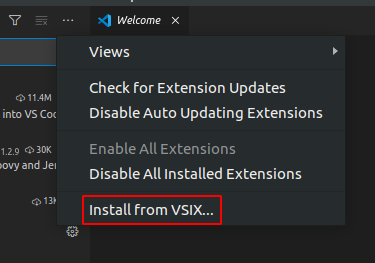

After that you will be able to use the plugin in any VS Code window.


### Eclipse Che Theia installation
TPS plugin is primarily meant for usage in Eclipse Theia which is the main editor in the Eclipse Che/ RADON IDE.
To install the plugin to Che you will need the prepared YAML devfile (which also uses the prepared meta.yaml file).
The files to try this can be found in [publishing-samples](./publishing-samples).

### Publishing
Here's what you need to do to test the plugin and to package/publish it:

```bash
# install Node JS from https://nodejs.org/en/download/
# and test it with node -v and npm -v command

# install prerequisite packages
npm install

# test the plugin in VS Code (this will open a new window with your extension loaded)
press F5 (Run Extension)

# package and publish the extension
# if you don't have npx install it with: npm install npx
npx vsce package
```

## Main features
The extension uses Template library REST API and can therefore invoke various Template library actions. 

Currently, supported actions are:

- [x] setting Template library REST API endpoint
- [x] creating and publishing TOSCA template or CSAR and its version
- [x] downloading a specific template version files
- [x] deleting saved login info (KeyCloak cookies)

## Usage
The plugin is invoked by right clicking on the file from file explorer or in the editor. There are four 
commands that can be selected from the dropdown options and these are further explained within the next sections. 

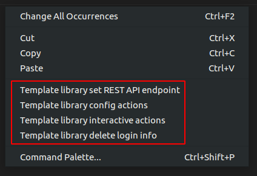

### Template library authentication
When right clicking on any Template library plugin command (except from set API endpoint and clean login info commands),
the extension will verify user's credentials if the data has been saved. So, the first time when user wants to use
the plugin, he will be offered a set of options to select the prefferd authentication method for the Template library.
Since Template library auth works through KeyCloak, there can be multiple login methods. You can login with:

- XLAB KeyCloak native credentials (available at https://openid-radon.xlab.si/auth/realms/master/account)
- RADON and other identity providers that are connected to the XLAB KeyCloak
- Native Template library credentials (a new user can be created by following these instructions: https://template-library-radon.xlab.si/)


If the login does not succeed, you will be warned and will have to login again. If the login succeeds, the KeyCloak auth cookies
will be stored into the local storage and next time you invoke the any plugin command, you won't have to login again. But if you
for instance set Template library API endpoint to something else or if you wish to login as another KeyCLoak user, the it is wise
to clear saved login data by invoking the "Delete login info" action. If you log in as a native user, no data will be saved and
you will have to login again every time you use the plugin.

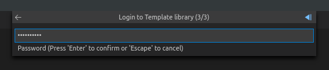

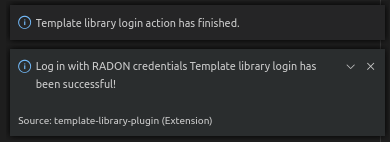

### Template library set REST API endpoint
This command is used to set TPS REST API endpoint that will be used for executing the TPS HTTP requests. The 
default value here is `https://template-library-radon.xlab.si/api` which is pointing to the public TPS REST API URL.
This command was meant mostly for testing different versions of TPS API so currently there is no need to change it.

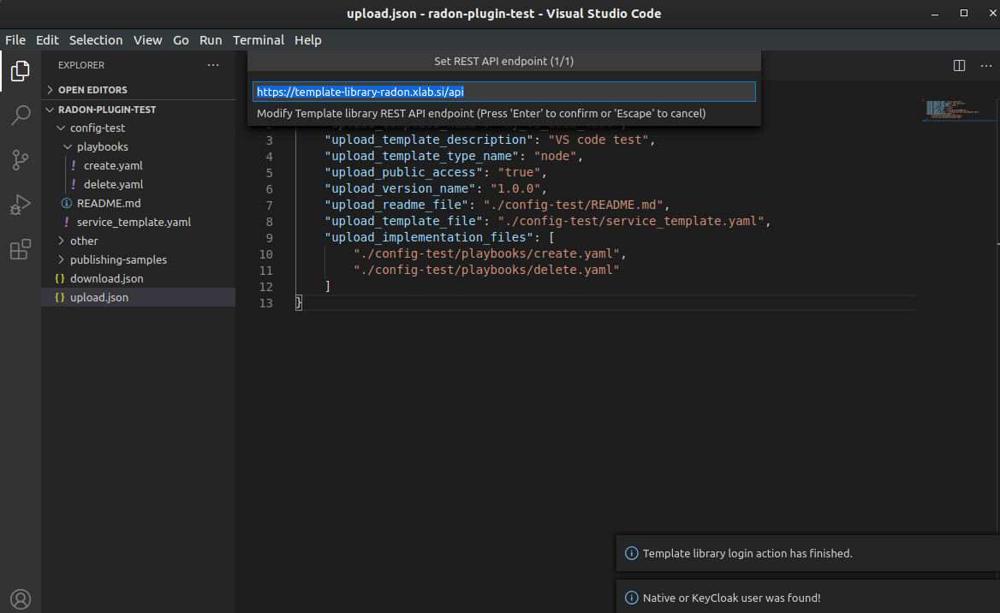

### Template library config actions
If you choose this option the TPS actions can be invoked via JSON config file. If you right clicked on the JSON
file (from the editor or from the file explorer) you will be offered to chose it as a config file. If not, you will
be asked to select this configuration file from other folders.

JSON object that is present in the config file should follow an exact structure with which depends on the type of the action.
The JSON keys specified are not mutally exclusive so you can execute muliple TPS actions with one JSON config file.

#### Create template JSON config
JSON object for creating a template must have all these keys:

|    JSON key      |   Description    |
|:-----------------|:-----------------|
| **uploadTemplateName** | Template name you want to create |
| **uploadTemplateDescription** | Template description |
| **uploadTemplateTypeName** | Template type name (one of: data, artifact, capability, requirement, relationship, interface, node, group, policy, csar, other) |
| **uploadPublicAccess** | Make template publicly visible for other TPS users (true/false) |

Example:

```json
{
    "uploadTemplateName": "AwsBucket",
    "uploadTemplateDescription": "AWS bucket node",
    "uploadTemplateTypeName": "node",
    "uploadPublicAccess": "true"
}
```
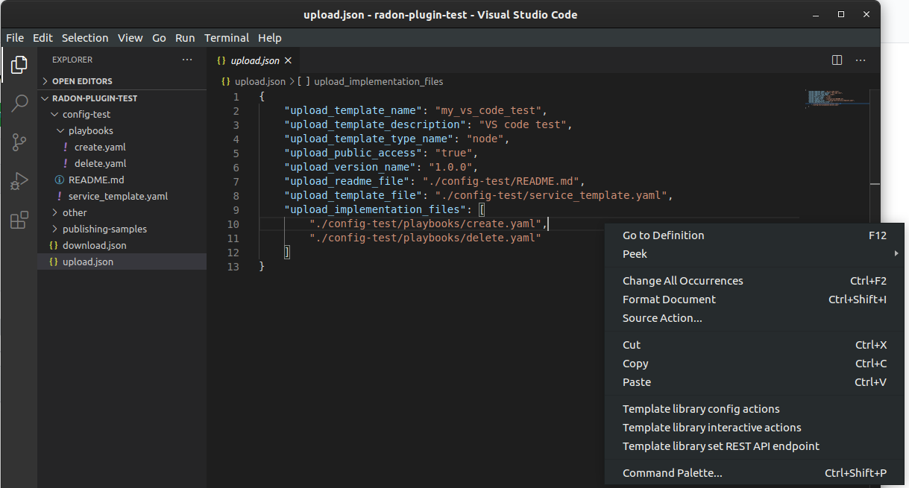

#### Upload template version JSON config
When uploading a template version you can use the following keys (`uploadReadmeFile` is optional).

|    JSON key      |   Description    |
|:-----------------|:-----------------|
| **uploadVersionName** | Semantic version name |
| **uploadReadmeFile** | Optional path to README file to upload |
| **uploadTemplateFile** | TOSCA YAML service template file or compressed TOSCA Cloud Service Archive (CSAR) |

Example:

```json
{
    "uploadVersionName": "2.1.5",
    "uploadReadmeFile": "./aws_bucket/README.md",
    "uploadTemplateFile": "./aws_bucket/service_template.yaml"
}
```

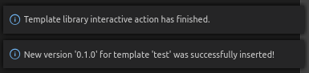

#### Download template version JSON config
When downloading template version files you will get all version files (TOSCA template and playbooks) compressed in a zip 
file (if you provided just a CSAR without implmentation files, you will get back this CSAR).

|    JSON key      |   Description    |
|:-----------------|:-----------------|
| **downloadTemplateName** | Name of the template you want to download |
| **downloadVersionName** | Semantic template version you want to get files from |
| **downloadPath** | Path where downloaded file will be stored |

Example:

```json
{
    "downloadTemplateName": "aws_bucket",
    "downloadVersionName": "2.1.5",
    "downloadPath": "./AwsBucket.zip"
}
```
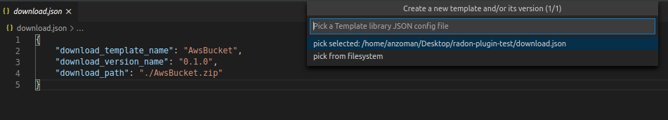
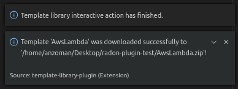

### Template library interactive actions
This TPS RADON IDE extension command will guide you through an interactive Eclipse Theia tasks, where you will be able
to create templates, upload template versions or download version files from Template library service. A few images
from the plugin are shown below.

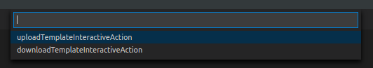
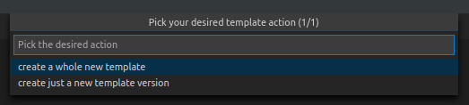
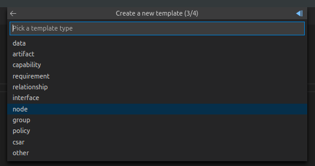
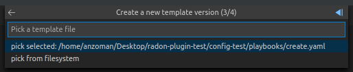

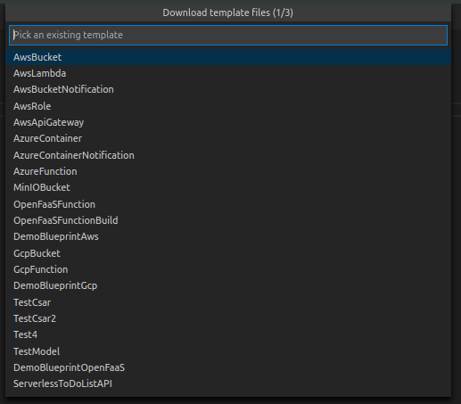
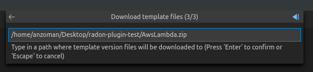

### Template library delete login info
This Template library plugin command will make sure that the saved login data gets deleted (e.g. KeyCloak cookies). After
that you will have to login again if you activate any TPS commands.